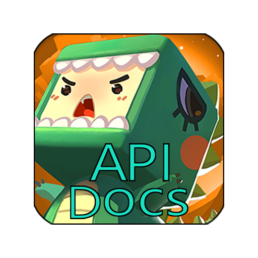

# MiniWorld-API-Docs



- 作者: K_Lan
- 声明文件版本: v0.2.2-main.2
- 支持的游戏版本: v1.52
- Lua版本: v5.1+
- 开发套件版本: v3.0

## 概述

《迷你世界》脚本 **API声明文件** 与 **模版文件**，消除VSC中的错误提示并提供代码自动补全，提高开发效率。

## 下载

1. **访问仓库页面**
    打开链接：[GitHub仓库链接 - MiniWorld-API-Docs](https://github.com/UU-cmyk/MiniWorld-API-Docs/)

2. **选择下载方式**
    您有三种主要方式获取文件：
    - **方式一：下载整个仓库**
        - 在仓库主页，找到并点击绿色的 "**<> Code**" 按钮。
        - 在弹出的菜单中，选择 "**Download ZIP**"。
        - 这将下载一个包含仓库所有文件的压缩包。解压后即可使用。

    - **方式二：克隆仓库**
        - 终端或命令行中，输入以下命令：

        ```shell
        git clone https://github.com/LK-cmyk/MiniWorld-API-Docs.git
        ```

        - 这将下载仓库的所有文件到本地。
        - **注意：如果您没有安装Git，请先下载安装。**

    - **方式三：下载单个文件**
        - 点开单个文件，点击下载按钮。
        - 这将下载单个文件。

## 使用

1. ### 如何使用 API 声明文件

    **步骤 1：复制声明文件**
        - 从本仓库中，将 `multiple` 文件夹 **或** `MNDeclaration.d.lua` 文件复制到你的项目文件夹中。

    **步骤 2：定位配置文件**
        - 打开你的项目文件夹，找到并进入 `.vscode` 子文件夹，然后用文本编辑器打开其中的 `settings.json` 文件。

    **步骤 3：修改配置路径**
        - 在 `settings.json` 文件中，找到 `lua.workspace.library` 这项配置，将其对应的路径值修改为：

    - **情况一：** 如果你复制的是 `multiple` 文件夹，则填写这个文件夹的路径。

    - **情况二：** 如果你复制的是 `MNDeclaration.d.lua` 文件，则填写这个文件本身的路径。

    - 最终保存 `settings.json` 文件即可。

2. ### 如何使用模版文件

    - 将本仓库中的 `./template/lua.code-snippets` 文件，复制到你项目文件夹下的 `.vscode` 目录中即可。

## v0.2.2-main.2 更新内容

1. 由 beta 分支进入 main 分支

### 当前进度

| 声明类型 | 进度 |
| --- | --- |
| 事件 | 完成 |
| 枚举库 | 完成 |
| 全局函数 | 完成 |
| 界面模块管理接口 - CustomUI | 完成 |
| 世界模块管理接口 - World | 完成 |
| 对象模块管理接口 - GameObject | 完成 |
| 角色模块管理接口 - Actor | 完成 |
| 玩家模块管理接口 - Player | 完成 |
| 物品模块管理接口 - Item | 完成 |
| 生物模块管理接口 - Monster | 完成 |
| 方块模块管理接口 - Block | 完成 |
| 背包模块管理接口 - Backpack | 完成 |
| 图文信息模块管理接口 - Graphics | 完成 |
| 区域模块管理接口 - Area | 完成 |
| 容器模块管理接口 - WorldContainer | 完成 |
| 资源模块管理接口 - Mod | 完成 |
| 计时器模块管理接口 - Timer | 完成 |
| 状态模块管理接口 - Buff | 完成 |
| 消息模块管理接口 - Chat | 完成 |
| 普通变量数据管理接口 - Data | 完成 |
| 数组变量数据管理接口 - Array | 完成 |
| 二维表变量数据管理接口 - Table | 完成 |
| 一维表 (KV表) 变量数据管理接口 - Map | 完成 |
| 组件管理接口 - Component | 完成 |

## 注意

- 此声明文件与模版文件仅支持 **开发3.0**。
- 此声明文件与模版文件可能与实际游戏版本有所出入，请以游戏版本为准。
- 如此声明文件与模版文件有问题请联系仓库管理员或所有者，或"Fork + Pull Request"。
